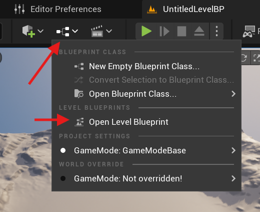

# Authentication

In this tutorial we will demonstrate how to utilize Unreal to perform general authentication requests that you can utilize in your own games.

## Estimated Time

Configuring Catena authentication in your Unreal project is estimated to take **< 10 minutes**.

## Prerequisites

1. You must be running Catena. It must be run locally or you must have it deployed somewhere. [Instructions for doing so can be found here](../../installation/index.md).
2. You must have completed the [Unreal Quickstart Guide](quickstart.md).

## Login

In this section we will demonstrate how to perform a login.
We will use the `CommonUser` plugin to kick off the login flow.
To learn more about the `CommonUser` plugin [you can read this documentation.](https://dev.epicgames.com/documentation/en-us/unreal-engine/common-user-plugin-in-unreal-engine-for-lyra-sample-game#commonusersubsystem)

For this login request we will be logging in using a test account.

### Player Login Using Blueprints

1. Run the editor
2. Click `Open Level Blueprint`. This can be found in the blueprint button left of the play button.
   
3. Right-click on the Event Graph. Search for `Get CommonUserSubsystem` and create the node.
4. Drag from this nodes return pin and search for `Try to Login User for Online Play` and create that node.
5. Finally, connect the `Event BeginPlay` exec pin to the input exec pin. Your event graph should look like this:
   
6. Press the Play button.

You will notice in your logs for the `LogOnlineServices` category a response message similar to:
```LogOnlineServices: Successfully logged in as a test user!```

With that you have successfully performed your first request to Catena!

### Player Login Using C++

#### 1. Create GameInstance Class
1. Run the editor
2. Click `Tools` -> `New C++ Class`
3. Choose `GameInstance` as the Parent Class
4. Click `Next`
5. Name class for your project and set desired path
6. Click `Create Class`
7. Open your IDE to the class files you have created.
   1. You can find your projects `.sln` file in the projects directory.
   2. Open the `.sln` file with your preferred editor.
8. Close the UE Editor.

#### 2. Set Your GameInstance Class As Default

In order for the engine to utilize your newly created game instance it needs to be configured in the `Project Settings`.
1. Select `Edit` -> `Project Settings`
2. In the `Project Settings` menu click on the search bar and type `GameInstance`
3. Under the `Maps & Modes` section override the `Game Instance Class` default with your newly created Game Instance.

Your project will now utilize your game instance class when playing.

#### 3. Add functionality To Your GameInstance Class

Next we will setup the class to call login when the game is initialized.
Open up your game instance class header file and add the following code:

``` c++ 
#pragma once

#include "CoreMinimal.h"
#include "Engine/GameInstance.h"
#include "MyGameInstance.generated.h"

namespace UE::Online
{
	class IAuth;
	class IOnlineServices;
}

UCLASS()
class CATENAEXAMPLE_API UMyGameInstance : public UGameInstance
{
	GENERATED_BODY()

public:
	// UGameInstance
	virtual void Init() override;

private:
	// Online
	void Login();

	TSharedPtr<UE::Online::IOnlineServices> OnlineServices;
	TSharedPtr<UE::Online::IAuth> AuthService;
};
```
Next, open up the .cpp file for this class and add the following code:

<!-- TODO: Add callback to login handle after we fix error with test login. -->
``` c++ 
#include "MyGameInstance.h"

#include "CommonUser/Public/CommonUserSubsystem.h"
#include "Online/OnlineServicesEngineUtils.h"

void UMyGameInstance::Init()
{
	Super::Init();

	OnlineServices = UE::Online::GetServices(GetWorld(), UE::Online::EOnlineServices::GameDefined_0);
	if (OnlineServices == nullptr)
	{
		UE_LOG(LogTemp, Error, TEXT("OnlineServices is null."));
		return;
	}

	AuthService = OnlineServices->GetAuthInterface();
	if (AuthService == nullptr)
	{
		UE_LOG(LogTemp, Error, TEXT("AuthService is null."));
		return;
	}
	
	// Kick off login request
	Login();
}

void UMyGameInstance::Login()
{
	UE::Online::FAuthLogin::Params LoginParameters;
	LoginParameters.PlatformUserId = FPlatformUserId::CreateFromInternalId(0);
	LoginParameters.CredentialsType = UE::Online::LoginCredentialsType::Auto;
	
	UE::Online::TOnlineAsyncOpHandle<UE::Online::FAuthLogin> LoginHandle = AuthService->Login(MoveTemp(LoginParameters));
}
```

#### 4. Perform Test Login

Finally, perform the following:
1. Run the UE editor using your IDE.
2. Press the `Play` button in the editor.

You will notice in your logs for the `LogOnlineServices` category a response message similar to:
```LogOnlineServices: Successfully logged in as a test user!```

<!-- TODO: Add logout documentation here once we enable support for it. -->

## Logout

### Player Logout Using Blueprints


Coming Soon!


### Player Logout Using C++


Coming Soon!


## Additional Information

### Command-line Arguments
If you would like, you can pass in command-line arguments when running the engine to configure the user logging in.
Some available command-line arguments are the following:
- `-session-id=<sessionId>` - This is the catena session id. This will typically be provided by the Catena launcher. <!-- Does this work for unreal currently? -->
- `UsernameOverride=<username-override>` - This is the username for the test account you are overriding.
- Test account usernames start with the word `test` followed by a two digit number, like so `test01`.
- The default test username is currently set to `test55`.

### Additional Content
For more information on project structure utilizing Online Services you can refer to [this documentation from Epic Games](https://dev.epicgames.com/documentation/en-us/unreal-engine/structure-and-implement-the-online-services-plugins-in-unreal-engine#overview) for further details and examples.
