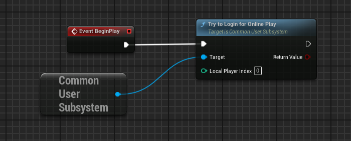

# Quickstart: Unreal


    Ensure you are [running Catena either locally or have it deployed somewhere](../../installation/index.md).


## Estimated Time
The initial integration of Catena to your Unreal project is estimated to take **~15 minutes**.

## Install the SDK
### 1. Obtain the SDK
Catena is distributed via Git. You must have Git installed. [Instructions for installing Git can be found here](https://git-scm.com/book/en/v2/Getting-Started-Installing-Git).

To gain access to the [Catena Unreal Plugin](https://github.com/CatenaTools/catena-unreal-plugin), please contact us to obtain a license. Once you have access, clone the repository to your machine using the following command.

```bash
git clone https://github.com/CatenaTools/catena-unreal-plugin.git
```

### 2. Install SDK


    The `OnlineServicesCatena` plugin requires the `CommonUser` plugin provided by Epic Games as a dependency. This can be obtained from the UE5 Lyra sample game source code on [Epic Games Github](https://github.com/EpicGames/UnrealEngine/tree/ue5-main/Samples/Games/Lyra/Plugins/CommonUser), or the Epic Games launcher after downloading the Lyra sample game.
    [More information can be found here](https://dev.epicgames.com/documentation/en-us/unreal-engine/common-user-plugin-in-unreal-engine-for-lyra-sample-game#installingtheplugin).


If your project does not contain a `Plugins` folder then create one. Copy the `OnlineServicesCatena` directory into the `Plugins` directory of your Unreal project. You should now have the SDK at `<your_unreal_project_path>/Plugins/OnlineServicesCatena/`.

### 3. Enable the Plugin


    Ensure that the `OnlineServices` plugin is enabled in order to utilize `OnlineServicesCatena`.


In order to utilize `OnlineServicesCatena` the plugin needs to be enabled.
Enabling `OnlineServicesCatena` can be done in one of two ways.

- Enable the plugin in the Editor:
    1. Open the editor
    2. Go to `Edit` -> `Plugins`
    3. Find Catena plugin `OnlineServicesCatena` and check the `Enabled` box
    4. Restart the Unreal Editor

- Enable the plugin in the `.uproject` file:
    1. Open you projects `.uproject` file
    2. Add the following value to the `Plugins` section
``` json
"Plugins": [
    {
        "Name": "OnlineServicesCatena",
        "Enabled": true
    }
]
```


## Configuration

### 1. Configure CommonUser

In order to use `OnlineServicesCatena` you will need to configure the `CommonUser` plugin from using the older `OnlineSubsystem` to the newer `OnlineServices`. This is partially done in the `CommonUser` plugin folder. If you do not have the plugin then install it from the [Epic Games Github](https://github.com/EpicGames/UnrealEngine/tree/ue5-main/Samples/Games/Lyra/Plugins/CommonUser). If you do not have access then [follow the steps here to gain access](https://www.unrealengine.com/en-US/ue-on-github).

Within the `CommonUser` plugin folder navigate and open the `CommonUser.Build.cs` file. The path should be like this `<your_unreal_project_path>/Plugins/CommonUser/Source/CommonUser.Build.cs`.

Find the `bUseOnlineSubsystemV1` variable and set it to false:
``` csharp
    bool bUseOnlineSubsystemV1 = false;
```

To finish enabling `OnlineServices` follow the next section.

### 2. Configure DefaultGame.ini

In your projects `Config` folder open up the file `DefaultGame.ini`.

Enable `OnlineServicesInterface` build dependencies for `OnlineServices` by adding the following:
``` ini
[/Script/Engine.OnlineEngineInterface]
bUseOnlineServicesV2=true
```

Add the following to set `OnlineServicesCatena` to be used as the default service:
``` ini
[OnlineServices]
DefaultServices=GameDefined_0
```

### 3. Configure DefaultEngine.ini

To set the backend url of  `OnlineServicesCatena` add the following:
``` ini
[OnlineServicesCatena]
BackendURL="http://localhost:5000"
```

The provided example will expect to hit a local running instance of the Catena backend.
The value can be changed depending on the backend instance you are trying to make requests to.


    To learn more on standing up Catena on a local instance or deploy on a live environment go here.


### 4. Edit Project Module Dependencies

Navigate to your projects `build.cs` file found under your projects `Source` folder. 

If you do not have a `Source` folder launch Unreal Engine click on `Tools` -> `New C++ Class...` and create a new class. 
This will generate the source code and solution for your project.

The `.build.cs` folder can be found in the following directory `<your_unreal_project_path>/Source/<ProjectName>/<ProjectName>.build.cs`.
Open the file and add `"CoreOnline"` & `"CommonUser"` to `PublicDependencyModuleNames`.
Your file will look similar to the following:
``` csharp

public class CatenaExample : ModuleRules
{
	public CatenaExample(ReadOnlyTargetRules Target) : base(Target)
	{
		PCHUsage = PCHUsageMode.UseExplicitOrSharedPCHs;
	
		PublicDependencyModuleNames.AddRange(new string[] { 
            "Core", 
            "CoreUObject", 
            "Engine", 
            "InputCore", 
            
            // Online features
            "CoreOnline", 
            "CommonUser" 
            });
        
        // Rest of code
    }
}
```

## Hello World

In this section we will demonstrate how to perform a login.
We will use the `CommonUser` plugin to kick off the login flow.
To learn more about the `CommonUser` plugin [you can read this documentation.](https://dev.epicgames.com/documentation/en-us/unreal-engine/common-user-plugin-in-unreal-engine-for-lyra-sample-game#commonusersubsystem)

### 1. Player Login

For this login request we will be logging in using a test account. 
By default, login is performed using a test account.

1. Run the editor
2. Click `Open Level Blueprint`. This can be found in the blueprint button left of the play button.

3. Right-click on the Event Graph. Search for `Get CommonUserSubsystem` and create the node.
4. Drag from this nodes return pin and search for `Try to Login User for Online Play` and create that node.
5. Finally, connect the `Event BeginPlay` exec pin to the input exec pin. Your event graph should look like this:

6. Press the Play button.

With that you have successfully performed your first request to Catena!

## Additional Information

### Command-line Arguments
If you would like, you can pass in command-line arguments when running the engine to configure the user logging in.
Some available command-line arguments are the following:
- `-session-id=<sessionId>` - This is the catena session id. This will typically be provided by the Catena launcher. <!-- Does this work for unreal currently? -->
- `UsernameOverride=<username-override>` - This is the username for the test account you are overriding.
- Test account usernames start with the word `test` followed by a two digit number, like so `test01`.
- The default test username is currently set to `test55`.

### Accessing Catena Subsystems
You can access the Catena subsystems in blueprints by searching for `Get CatenaSubsystem` & `Get CatenaSessionSubsystem`.

## What Next?
Now that you've successfully made your first call, you probably want to achieve something more tangible. You can explore other APIs that the SDK provides to build out additional features for your game.
