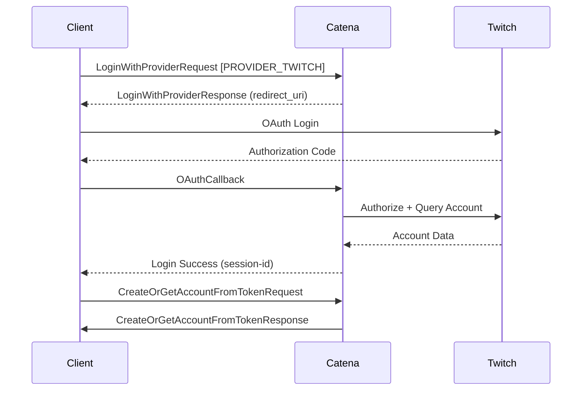

---
markdown:
  toc: 
    depth: 3
---

# Accounts

Catena provides an accounts system that is designed for maximum flexibility. The rest of Catena is designed to _not_ depend on Catena's provided Accounts implementation; as a result, you can bring your own Accounts implementation and swap it out for Catena's.

## How does Catena define an account?

The fields on an account are shown below. Catena primarily cares about the `account_id` and `display_name`, with the `auth_role` being the tie in to the authentication system when using Catena's provided accounts implementation.

| Field        | Type      | Description                                                                                                                         |
|--------------|-----------|-------------------------------------------------------------------------------------------------------------------------------------|
| account_id   | string    | The account ID of the user, in catena, these are in the form `account-f5c1791c-24d1-4bec-824a-866794b3f045`                         |
| display_name | string    | A user's display name, usually pulled from the first provider they logged in with.                                                  |
| auth_role    | string    | The user's authentication level                                                                                                     |
| metadata     | key-value | Key value pairs representing additional metadata on the account. This data can specified depending on the requirements of your game |

An account may have an arbitrary number of **metadata key-value pairs** associated with it. These values are typed in order to enable you to write more robust code.

| name           | type    |
|----------------|---------|
| key            | string  |
| int_payload    | integer |
| string_payload | string  |

## Creating a new Account


The account creation flow ties in with the [Auth Framework](/core/auth/index.md); parts of this interface can be swapped out as needed in order to support differing requirements.


The diagram below shows the default out-of-the-box auth flow for Catena using Twitch Authentication. Each step is described in detail below.

### Create a new session

In a default configuration, prior to creating an account (or logging into an existing account) the user must first get a provider login session. This can be thought of as an identifier tied to a third party, like Discord or Twitch that uniquely identifies the user.

After the user hits the `LoginWithProvider` API and completes the flow, they will have a session in the Catena backend. This session can then be used by the account service to create the user's account.



### Creating a new account / fetching an existing account

After the user has created their login session, they can follow the steps below.

When the `AccountsService` receives a `CreateOrGetAccountFromTokenRequest`, it will use the **provider account ID**, **provider display name**, and **provider type** stored in the `ProviderLoginPayload` in the [session store](../../core/auth/sessions.md#producing-a-session) created at login to query the accounts database. This checks whether an account has previously been created with the same provider information.

If such an account exists, the handler for `CreateOrGetAccountFromToken` will return the account in a `CreateOrGetAccountFromTokenResponse`. Additionally, it will update the user's session to reference this account.

Otherwise, an account with this provider information will be created, with the role of `user` by default. Its base-64 representation will be added to the session store, and it will be returned in a `CreateOrGetAccountFromTokenResponse` by the method handler.



## Fetching an existing account by ID

The Catena `AccountsService` supports fetching an existing account by its ID via `GetAccountById`.



## Updating an Account

The `AccountsService` also supports updating an account — specifically its **display name** and **associated metadata** — via `UpdateAccount`.




**Note:** This RPC facilitates account updates via `google.protobuf.FieldMasks`, meaning that only the data specified in the update request will be overwritten. The rest of the account’s data will remain unchanged.

