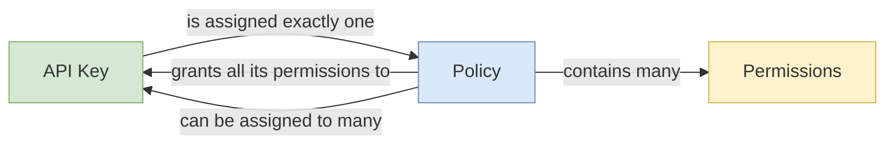

# API Keys

API keys are typically used to authorize services rather than users. Each API key is
created with a [policy](#policies), which grants a set of permissions to services using the key.

## Create an API key

Creating a new API key may be done in the admin dashboard or by calling `AdminCreateApiKey`. A new API key needs a unique name and a single policy. Assigning a policy an API key grants the key all of the permissions associated with that policy.


In order to create an API key, at least one policy must be available (see [Managing policies](#managing-policies)).


Policies are associated with keys via unique IDs. When creating an API key in the dashboard, a dropdown list of the currently available policies will be displayed. (This list can also be obtained by calling `AdminGetApiKeyPolicies`.)

## Update or delete API keys

API keys can be updated and deleted from the admin dashboard, or by calling `AdminUpdateApiKey`/`AdminDeleteApiKey`.

When you change the policy associated with an API key, the permissions granted to that key will change accordingly, effective immediately. 


When you delete an API key, all services currently using that key will lose API access. These changes will go into effect immediately.


## Policies

Policies are used to bestow a set of granular permissions to individual API keys. Each API key is assigned a single policy; each policy can be assigned to an unlimited number of API keys.

### Permissions

Typically, a service managing API keys, such as the `CatenaApiKeysService`, will collect all the available permissions,
which can then be used to build policies that are applied to API keys.

<!-- TODO: When, how, and by whom are permissions created/defined? -->

### Managing policies

You can create, update, and delete policies in the admin dashboard (or by directly calling the related [RPCs](../../apis/catena-tools-core/catenaapikeys)).

When you create a policy, you will be prompted for a unique policy name, and a list of permissions to associate with that policy. On the dashboard, the list of
available permissions will be displayed for you. (You can also obtain them by calling `AdminGetApiKeyPermissions`.)

Just as changing the policy on an API key will immediately change its permissions, changing the permissions on a policy will immediately impact all API keys
currently using that policy.


Deleting a policy will have a cascade effect: all API keys currently using that policy will be deleted, and services using those API keys will lose access.


## More information 

- For information on the architecture of the API key service, see [API Keys](../../core/auth/api-keys.md).
- You can also check out all the RPCs available in the Catena API key service [here](../../apis/catena-tools-core/catenaapikeys).
