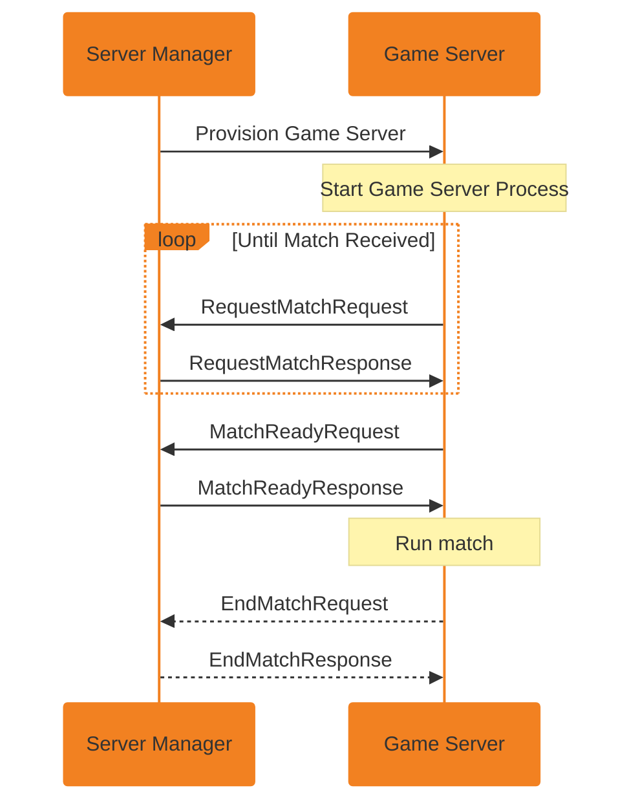

---
markdown:
  toc:
    depth: 4
---

# Catena - Game Servers
The Catena Match Broker is responsible for assigning matches to dedicated game servers It is completely decoupled from the [Catena Matchmaker](../matchmaking/index.md), allowing them both to operate independently.

## How The Match Broker Works

The Catena Match Broker listens for `new-match` events that are emitted by a matchmaker and coordinates **dedicated game servers** to satisfy that match's requirements.

### Components

#### Server Manager

The Catena Match Broker keeps a list of available **game servers** via an embedded **Server Manager**.

#### Allocator
If more servers are necessary, the **Match Broker** will use an **Allocator** to provision them. See [Available Configuration Options](#available-configuration-options) for more information about available allocators, including under what circumstances you may want to use one vs. another.

#### Game Servers
**Game servers** register themselves with the **server manager** within the Match Broker and are expected to make a few different calls to keep their status up to date.

* `RequestMatch` registers the **game server** with the **server manager**, specifying the type of match that a game server is able to support. The **game server** may call this many times, until it receives a response from the **server manager** that a match has been assigned to it
* `MatchReady` updates the **server manager**, informing it of the connection details of the game server and indicating that the game server is ready to accept players. This may be sent directly after a match has been assigned to a **game server** or can be sent after the game server has finished configuring the match type
* `EndMatch` updates the **server manager**, informing it that a match is complete and the server can be deallocated.

### Data Flow


## Configuring The Catena Match Broker
The Catena Match Broker is configured using appsettings files in `catena-tools-core`.

### Basic Example
_Note: This example does not include any **Allocators**, and therefore won't provision any servers. To view available **Allocator** configurations, see the [Available Configuration Options](#available-configuration-options) below._

```json
{
"Catena": {
    ...
    "MatchBroker": {
        "FastSchedule": 1,
        "ServerMaxLifetimeMinutes": 10,
        "MatchPickupTimeSeconds": 90,
        "MatchReadyTimeSeconds": 30,
        "MatchMaxRunTimeMinutes": 10,
        "ScheduleFrequencySeconds": 30,
        "DelayAllocationSeconds": 30,
        "Allocators": []
    }
    ...
} 
```

### Available Configuration Options
Let's take a look at all the available properties in the `MatchBroker` config.

| Property | Definition |
|-|-|
| `FastSchedule` | Options: `0`, `1`, `2`. Whether to allocate a server as soon as a new match arrives, if necessary. Reduces latency but potentially increases idle server overhead. This must be disabled when utilizing **backfilling**.<br/>If `0` is configured, fast scheduling will be disabled.<br/>If `1` is configured, running game servers that are able to support a match will be assigned before spinning up a new server.<br/>If `2` is configured, a new game server will be provisioned for every match no matter what. |
| `ServerMaxLifetimeMinutes` | The maximum amount of time a game server process is expected to be extant.<br/>If this timer is hit, the Match Broker will be considered unusable and deallocated. |
| `MatchPickupTimeSeconds` | The maximum amount of time a match can be queued by the Match Broker before the server is considered to have failed. Hitting this timer may indicate that a server didn't start, couldn't be allocated, there were network communication problems, incorrect SDK integration, or some other misconfiguration that prevented a `RequestMatch` call from the game server from arriving at the backend.<br/>If this timer is hit, the Match Broker will emit an event to clients in the match that a server could not be obtained for their match. |
| `MatchReadyTimeSeconds` | This timer starts when a match is picked up by a game server. Its expiration indicates that a game server did not call `MatchReady` in a timely manner.<br/>If this timer is hit, the Match Broker will emit an event to clients in the match that a server could not be obtained for their match. |
| `MatchMaxRunTimeMinutes` | The maximum amount of time the backend will wait for a server to call `EndMatch` before deallocating it. This value should be slightly longer than how long your longest match type takes, as it should never be triggered. This timer's expiration indicates that a game server has failed or has failed to communicate to the backend.<br/>If this timer is hit, the Match Broker will deallocate the server and will emit an event to clients in the match that the match is over. |
| `ScheduleFrequencySeconds` | The amount of time between attempts to allocate servers when there are queued matches. A longer interval can handle higher match rates more efficiently, but can lead to longer match start times. The minimum value permitted is `30` seconds. |
| `DelayAllocationSeconds` | The maximum amount of time to wait for a match to be picked up by an existing game server before starting a new game server.<br/>_Note: `FastSchedule` must be disabled for this to be effective._<br/>The minimum value permitted is `ScheduleFrequencySeconds`. |
| `Allocators` | Configured allocators to provision new game servers. |

<!-- TODO: What is the difference between ServerMaxLifetimeMinutes and MatchMaxRunTimeMinutes -->
<!-- From inspection in the code, it appears that there is the beginning components of the differentiation of servers and matches (i.e. a server can have many matches), though we don't currently fully support running multiple matches on a single server -->

Let's take a look at all the available properties in the `Allocators` config within the `MatchBroker` config.

| Property | Definition |
|-|-|
| `Allocator` | The class name of the allocator |
| `AllocatorDescription` | A human readable name or description of the allocator to differentiate it when multiple instances of an allocator are used. Defaults to the class name of the allocator if unset. |
| `Requirements` | The requirements/filters applied to determine whether this allocator can be utilized for a given match. Leave empty if there are no requirements and you only want to use one allocator. |
| `Configuration` | Configuration for this specific allocator. The options within this section will vary based on the allocator. |

The `Configuration` block will vary depending on the allocator you choose.

#### CatenaLocalBareMetalAllocator

The `CatenaLocalBareMetalAllocator` can start and manage game server processes alongside the Catena backend. It is great for early development, as you can test your full game loop locally or on a cloud machine with the capacity to run one or more game servers.


    If you have deployed Catena to Heroku, the `CatenaLocalBareMetalAllocator` is not supported. If you would like to run this allocator, refer to [Installation Options](/installation/index.md) to deploy Catena using a different configuration.


```json
...
"Allocators": [
    {
        "Allocator":"CatenaLocalBareMetalAllocator",
        "AllocatorDescription": "Human Readable Description",
        "Configuration": {
            "GameServerPath": "<full-path-to-game-server-executable>",
            "GameServerArguments": "<optional-arguments-for-game-server>",
            "GameServerEnvironment": {},
            "ReadyDeadlineSeconds": 30,
            "ReaperConfiguration": {
                "AllocatorReaperPeriodSeconds": 10,
                "MaxRunTimeMinutes": 125
            }
        },
        "Requirements": ""
    }
]
...
```

| Property | Definition |
|-|-|
| `GameServerPath` | The full path to your game server executable |
| `GameServerArguments` | Command-line arguments to supply to the game server executable |
| `GameServerEnvironment` | Environment variables to set when starting the game server executable. May be empty or unset |
| `ReadyDeadlineSeconds` | The amount of time the Match Broker can expect to wait for a server to respond after it is allocated |
| `ReaperConfiguration.AllocatorReaperPeriodSeconds` | How often the reaper checks existing processes |
| `ReaperConfiguration.MaxRunTimeMinutes` | The maximum amount of time a game server process should be extant. Used as a last-ditch method within the allocator if the Match Broker's **Server Manager** loses track of a server. This value should be longer than the `MatchMaxRunTimeMinutes` configuration value. |

#### CatenaEc2DirectAllocator


#### CatenaGameLiftAllocator


#### CatenaManagedHostAllocator
